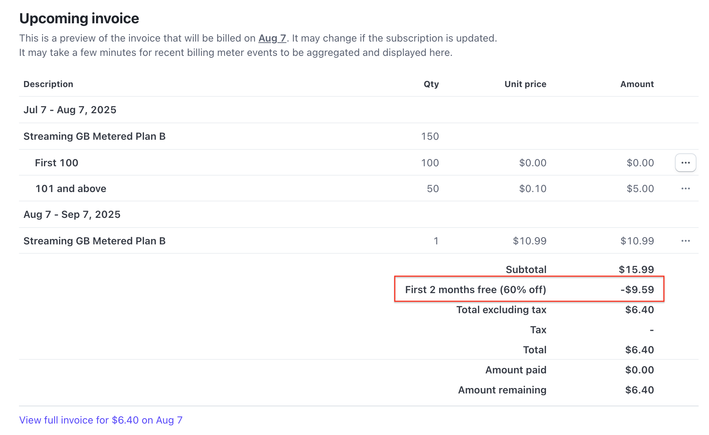

# Stripe Subscription Billing Examples

This repository contains two example Python scripts that demonstrate how to implement subscription billing using the [Stripe API](https://stripe.com/docs/api). These examples show how to set up two types of streaming service plans:

* **Plan A**: Unlimited streaming for a flat monthly fee.
* **Plan B**: Metered streaming plan — includes 100 GB per month with overage charges.
* **Plan C**: Metered streaming planB with applyed coupon logic.

  example screenshot of what you can see on the Stripe dahsbord runing the coupon logic script:
  
  

---

## 📁 Contents

| File                          | Description                                                                                |
| ----------------------------- | ------------------------------------------------------------------------------------------ |
| `plan_a_flat_subscription.py` | Flat-rate monthly billing example using Stripe Subscriptions.                              |
| `plan_b_metered_billing.py`   | Usage-based metered billing example using Stripe Metering API and graduated pricing tiers. |
| `plan_b_metered_coupon.py`    | Usage-based metered billing example with applyed coupon logic using Stripe coupon API      |

---

## 🥪 Prerequisites

* Python 3.7+
* Stripe Python SDK:

  ```bash
  pip install stripe
  ```
* A Stripe (use a Test API Key)
* A test payment method like `pm_card_visa` (built-in by Stripe)

---

## 🚀 Quick Start

1. **Clone the repository**:

   ```bash
   git clone https://github.com/your-org/stripe-subscription-examples.git
   cd stripe-subscription-examples
   ```

2. **Install dependencies**:

   ```bash
   pip install stripe
   ```

3. **Set your API key**:
   Replace the test secret key in both scripts with your Stripe test key:

   ```python
   stripe.api_key = "sk_test_..."
   ```

4. **Run the script**:

   For flat subscription (Plan A):

   ```bash
   python plan_a_flat_subscription.py
   ```

   For metered billing (Plan B):

   ```bash
   python plan_b_metered_billing.py
   ```

   For metered billing (Plan B):

   ```bash
   python plan_b_metered_coupon.py
   ```
---

## 💡 Overview of Plans

### 🟢 Plan A: Unlimited Flat Subscription

* Monthly price: **\$24.99**
* Customer is billed a fixed amount each month.
* Basic Stripe objects used: `Product`, `Price`, `Customer`, `Subscription`

### 🟡 Plan B: Metered Usage Subscription

* Base price: **\$10.99/month** for the first 100 GB
* Overage charge: **\$1.00 per 10 GB** beyond 100 GB
* Uses `stripe.billing.Meter` and `stripe.billing.MeterEvent` 
* Demonstrates tiered usage pricing and usage event reporting

### 🟡 Plan C: Metered Usage Subscription with coupon logic

* Base price: **\$10.99/month** for the first 100 GB
* Overage charge: **\$1.00 per 10 GB** beyond 100 GB
* Coupon applied for 1st 2months of use, and limited to teh first 10 signups
* Uses `stripe.Coupon` 
* Demonstrates usage of coupon API on subscription objects
* screenshot from dahsbord of how the 2nd billing scyle would look like the folwing :

  
---

## ⚠️ Disclaimers

* These scripts are provided **"AS IS"** without warranty.
* Use only in the **Stripe sandbox/test mode**.
* Hardcoded API keys are insecure — in production, use environment variables or secret managers.
* No database or user input handling is included. You are responsible for securing and scaling logic appropriately.


---

## 🛡️ License

Creative Commons Zero License © 2025 – Abdelbar
